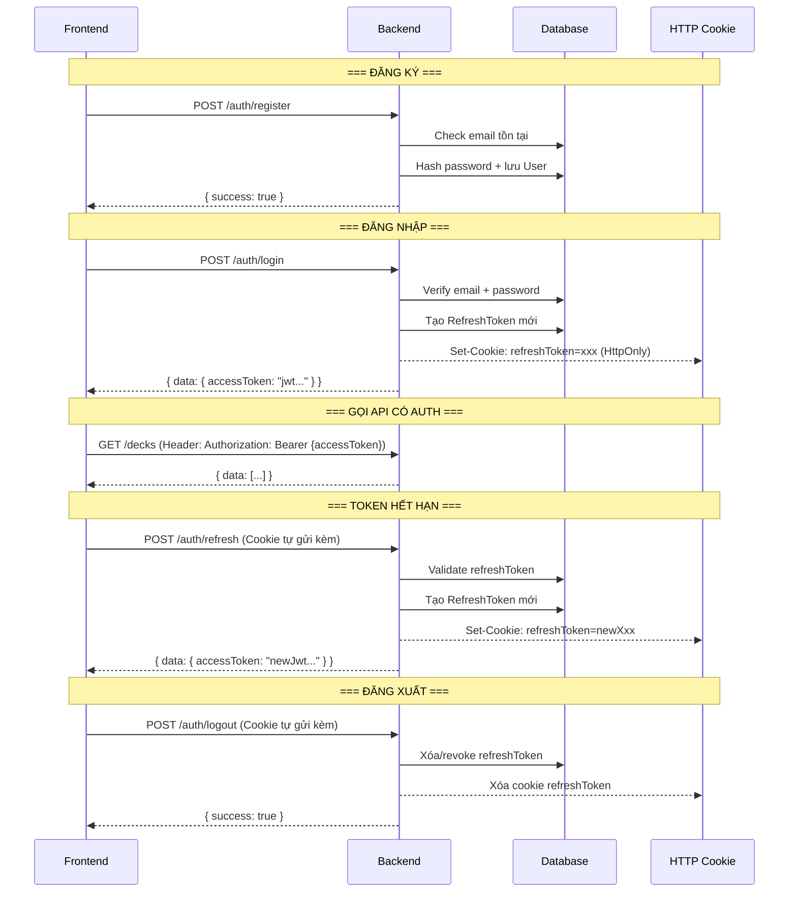
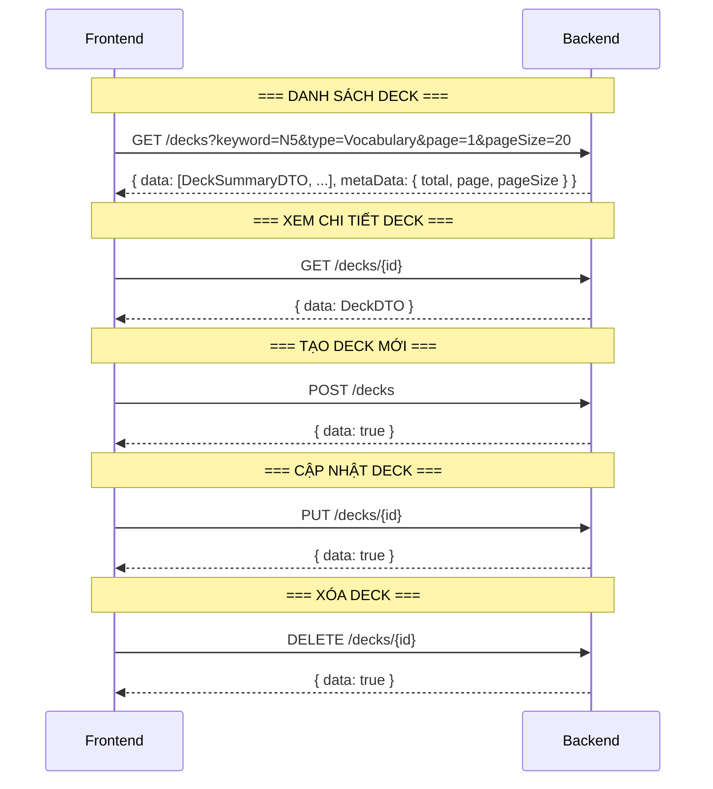
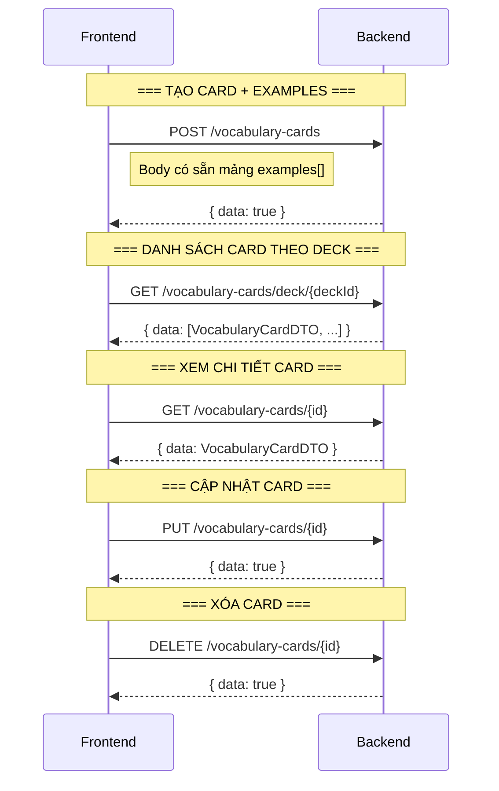
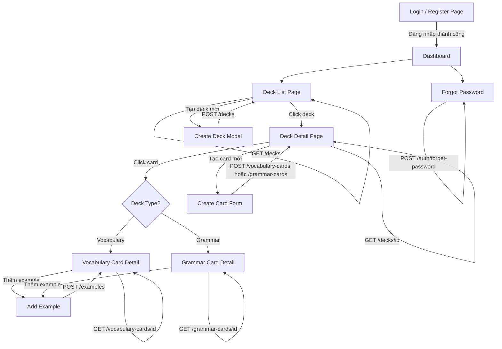

# API Flows — Learning App

> Base URL: `http://localhost:5246`
> Tất cả API trả về format `ApiResponse<T>`:
>
> ```json
> {
>   "code": 200,
>   "success": true,
>   "message": null,
>   "data": { ... },
>   "metaData": { "total": 50, "page": 1, "pageSize": 20 }  // chỉ có khi phân trang
> }
> ```

---

## 1. Auth Flow — Xác thực người dùng



### Endpoints

| Method | Route                           | Body                   | Response               | Auth |
| ------ | ------------------------------- | ---------------------- | ---------------------- | ---- |
| POST   | `/auth/register`                | `RegisterRequest`      | `bool`                 | ❌   |
| POST   | `/auth/login`                   | `LoginRequest`         | `AuthDTO` + Set Cookie | ❌   |
| POST   | `/auth/refresh`                 | _(cookie tự gửi)_      | `AuthDTO` + Set Cookie | ❌   |
| POST   | `/auth/logout`                  | _(cookie tự gửi)_      | `bool` + Xóa Cookie    | ❌   |
| POST   | `/auth/forgot-password?email=x` | _(query)_              | `bool`                 | ❌   |
| POST   | `/auth/reset-password`          | `ResetPasswordRequest` | `bool`                 | ❌   |

### DTOs

```typescript
// === Request ===
RegisterRequest {
  username: string
  email: string
  password: string
}

LoginRequest {
  email: string
  password: string
}

ResetPasswordRequest {
  token: string        // token nhận từ email
  newPassword: string
}

// === Response ===
AuthDTO {
  accessToken: string  // JWT, frontend lưu vào memory/localStorage
  // refreshToken không trả về JSON, chỉ set qua HttpOnly Cookie
}
```

### Frontend cần làm:

1. Lưu `accessToken` vào memory (hoặc localStorage)
2. Gắn `Authorization: Bearer {token}` vào mọi request cần auth
3. Khi nhận 401 → gọi `/auth/refresh` → lấy accessToken mới → retry request
4. Đảm bảo `credentials: 'include'` (fetch) hoặc `withCredentials: true` (axios) để gửi cookie

---

## 2. Deck Flow — Quản lý bộ thẻ



### Endpoints

| Method | Route         | Body / Query                         | Response                      | Auth |
| ------ | ------------- | ------------------------------------ | ----------------------------- | ---- |
| GET    | `/decks`      | `?keyword=&type=&page=1&pageSize=20` | `DeckSummaryDTO[]` + MetaData | ✅   |
| GET    | `/decks/{id}` | —                                    | `DeckDTO`                     | ✅   |
| POST   | `/decks`      | `CreateDeckRequest`                  | `bool`                        | ✅   |
| PUT    | `/decks/{id}` | `UpdateDeckRequest`                  | `bool`                        | ✅   |
| DELETE | `/decks/{id}` | —                                    | `bool`                        | ✅   |

### DTOs

```typescript
// === Request ===
CreateDeckRequest {
  name: string
  description: string
  type: "Vocabulary" | "Grammar"    // enum gửi dạng string
}

UpdateDeckRequest {
  name: string
  description: string
}

SearchDeckQuery {                   // query params
  keyword: string
  type: string                      // "Vocabulary" | "Grammar" | ""
  page: number                      // default 1
  pageSize: number                  // default 20
}

// === Response ===
DeckSummaryDTO {                    // danh sách (GET /decks)
  id: string
  name: string
  type: "Vocabulary" | "Grammar"
  cardNumber: number
  author: { id: string, username: string }
}

DeckDTO {                           // chi tiết (GET /decks/{id})
  id: string
  name: string
  description: string
  type: "Vocabulary" | "Grammar"
  author: { id: string, username: string }
  cards: PreviewCardDTO[]           // danh sách thẻ preview
}

PreviewCardDTO {
  id: string
  term: string
  meaning: string
}
```

---

## 3. Vocabulary Card Flow — Thẻ từ vựng



### Endpoints

| Method | Route                             | Body                          | Response              | Auth |
| ------ | --------------------------------- | ----------------------------- | --------------------- | ---- |
| POST   | `/vocabulary-cards`               | `CreateVocabularyRequest`     | `bool`                | ✅   |
| GET    | `/vocabulary-cards/deck/{deckId}` | —                             | `VocabularyCardDTO[]` | ✅   |
| GET    | `/vocabulary-cards/{id}`          | —                             | `VocabularyCardDTO`   | ✅   |
| PUT    | `/vocabulary-cards/{id}`          | `UpdateVocabularyCardRequest` | `bool`                | ✅   |
| DELETE | `/vocabulary-cards/{id}`          | —                             | `bool`                | ✅   |

### DTOs

```typescript
// === Request ===
CreateVocabularyRequest {
  term: string
  meaning: string
  deckId: string
  examples: CreateExampleSentenceRequest[]   // tạo kèm examples luôn
}

UpdateVocabularyCardRequest {
  term: string
  meaning: string
}

// === Response ===
VocabularyCardDTO {
  id: string
  term: string
  meaning: string
  deckId: string
  examples: ExampleSentenceDTO[]
}
```

---

## 4. Grammar Card Flow — Thẻ ngữ pháp

### Endpoints

| Method | Route                          | Body                       | Response           | Auth |
| ------ | ------------------------------ | -------------------------- | ------------------ | ---- |
| POST   | `/grammar-cards`               | `CreateGrammarCardRequest` | `bool`             | ✅   |
| GET    | `/grammar-cards/deck/{deckId}` | —                          | `GrammarCardDTO[]` | ✅   |
| GET    | `/grammar-cards/{id}`          | —                          | `GrammarCardDTO`   | ✅   |
| PUT    | `/grammar-cards/{id}`          | `UpdateGrammarCardRequest` | `bool`             | ✅   |
| DELETE | `/grammar-cards/{id}`          | —                          | `bool`             | ✅   |

### DTOs

```typescript
// === Request ===
CreateGrammarCardRequest {
  term: string
  meaning: string
  structure: string
  explanation?: string
  caution?: string
  deckId: string
  examples: CreateExampleSentenceRequest[]
}

UpdateGrammarCardRequest {
  term: string
  meaning: string
  structure: string
  explanation?: string
  caution?: string
}

// === Response ===
GrammarCardDTO {
  id: string
  term: string
  meaning: string
  structure: string
  explanation?: string
  caution?: string
  deckId?: string
  examples: ExampleSentenceDTO[]
}
```

---

## 5. Example Sentence Flow — Câu ví dụ

> Examples được tạo kèm Card (qua `CreateVocabularyRequest.examples` hoặc `CreateGrammarCardRequest.examples`).
> Sau đó có thể thêm/sửa/xóa riêng lẻ:

### Endpoints

| Method | Route            | Body                       | Response | Auth |
| ------ | ---------------- | -------------------------- | -------- | ---- |
| POST   | `/examples`      | `CreateCardExampleRequest` | `bool`   | ✅   |
| PUT    | `/examples/{id}` | `UpdateCardExampleRequest` | `bool`   | ✅   |
| DELETE | `/examples/{id}` | —                          | `bool`   | ✅   |

### DTOs

```typescript
// === Request ===
CreateCardExampleRequest {
  clozeSentence: string        // "Tôi ___ ăn cơm"
  expectedAnswer: string       // "đã"
  hint?: string
  vocabularyCardId?: string    // 1 trong 2 phải có giá trị
  grammarCardId?: string
}

CreateExampleSentenceRequest {  // dùng khi tạo kèm Card
  clozeSentence: string
  expectedAnswer: string
  hint?: string
}

UpdateCardExampleRequest {
  clozeSentence: string
  expectedAnswer: string
  hint?: string
}

// === Response ===
ExampleSentenceDTO {
  id: string
  clozeSentence: string
  expectedAnswer: string
  fullSentence: string          // câu đầy đủ đã điền answer
  hint?: string
}
```

---

## 6. Luồng tổng quan — Frontend Page Mapping



## 7. Error Code Reference

| Code                | Message Constant        | Ý nghĩa                 | HTTP Code |
| ------------------- | ----------------------- | ----------------------- | --------- |
| `Common_404`        | `NOT_FOUND`             | Không tìm thấy resource | 200       |
| `Common_400`        | `INVALID`               | Dữ liệu không hợp lệ    | 200       |
| `Common_401`        | `UNAUTHORIZED`          | Chưa xác thực           | 401       |
| `Common_405`        | `NOT_ALLOW`             | Không có quyền (IDOR)   | 401       |
| `Common_505`        | `INTERNAL_SERVER_ERROR` | Lỗi server              | 500       |
| `Invalid_400`       | `INVALID_LOGIN`         | Sai email/password      | 200       |
| `Email_Exist_409`   | `EMAIL_EXIST`           | Email đã tồn tại        | 200       |
| `Token_Expried_409` | `TOKEN_EXPIRED`         | Token hết hạn           | 401       |

> **Frontend**: Check `response.success` trước. Nếu `false`, dùng `response.message` (error code) để hiển thị lỗi phù hợp bằng cách map sang ngôn ngữ (i18n).
